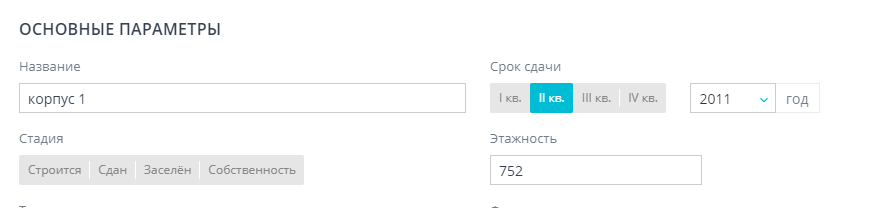

# FormBuilderGroup

### Основное

**Расположение:** \
vue/shared/vue-ui/src/components/FormBuilder/components/FormBuilderGroup.vue

Компонент принимает в себя объект группы с вложенными в него элементами. Отрисовывает поля и вложенные группы кроме групп с типом MAIN.

<details>

<summary>Пример объекта с которым работает FormBuilderGroup</summary>

```javascript
{
  name: "Параметры жилого комплекса",
  groupType: "MAIN",
  hint: null,
  order: 0,
  parentGroupName: null,
  suffix: null,
  elements: [
    {
      name: "name",
      title: "Название",
      value: "ЖК Руда",
      fieldDependencyList: null,
      listOptions: null,
      required: false,
      groupName: "Параметры жилого комплекса",
      order: 0,
      hint: null,
      type: "TEXT",
      inputType: "String",
      placeholder: null,
    },
    {
      name: "housing_class",
      title: "Класс жилья",
      value: "1",
      fieldDependencyList: null,
      listOptions: [
        {
        name: "Эконом",
        idField: null,
        description: null,
        value: "1",
        },
        {
        name: "Комфорт",
        idField: null,
        description: null,
        value: "2",
        },
      ],
      required: false,
      groupName: "Параметры жилого комплекса",
      order: 1,
      hint: null,
      type: "SINGLE_CHOICE_TILES",
      inputType: "Int",
      placeholder: null,
    },
    {
      name: "builder",
      title: "Застройщик",
      value: "222",
      fieldDependencyList: null,
      listOptions: [
        {
        "name": "(RBI) Северный город",
        "idField": null,
        "description": null,
        "value": "4",
        "__typename": "ListOption"
        },
      ],
      required: false,
      groupName: "Параметры жилого комплекса",
      order: 2,
      hint: null,
      type: "SELECT",
      inputType: "Int",
      placeholder: null,
    },
  ]
}
```

</details>

По умолчанию компонент FormBuilderGroup может отрисовать один уровень вложенности, т.е. поля и одну группу с полями.\
Например есть группа "Основные параметры" типа MAIN, в нее входят поля: "Название", "Стадия", "Этажность" и группа "Срок сдачи" типа "CUMULATIVE\_FIELD" с полями "квартал" и "год".

<figure><figcaption></figcaption></figure>

В этом случае компонент сможет отрисовать эту форму самостоятельно.

Если же вложенность группы больше 2, например:

```
Группа MAIN {
  поле 
  поле
  Группа 2 {
    поле
    поле
    Группа 3 {
      поле 
      поле
    }  
  }  
}    
```

В этом случае необходимо делать рекурсивную отрисовку компонентов, путем вкладывания компонента FormBuilderGroup в самого себя:

```html
<FormBuilderGroup
    v-for="group in getRenderForm"
    :key="group.order"
    :group="group"
    :changeField="inputField"
>
<template v-if="group.groupType">
    <FormBuilderGroup
        v-for="subgroup in group.elments"
        :key="subgroup group.order"
        :group="subgroup group"
        :changeField="inputField"
    />
</template>
    
</FormBuilderGroup>
```

### Props

| Свойство    | Тип       | Описание                                                                                                                                                                                                                                                                                                                                                                       |
| ----------- | --------- | ------------------------------------------------------------------------------------------------------------------------------------------------------------------------------------------------------------------------------------------------------------------------------------------------------------------------------------------------------------------------------ |
| group       | Object    | Объект группы из модели рендеринга. Обязательно должен содержать свойства: name, elements, groupType                                                                                                                                                                                                                                                                           |
| changeField | Function  | <p>Функция, которая отрабатывает при изменении значения в каком то поле. Принимает в себя три параметра:<br><strong>value</strong> - значение которое передано в поле,<br><strong>field</strong> - объект самого поля,<br><strong>deps</strong> - либо null, либо объект зависимостей поля. В этом объекте есть тип зависимости и названия полей которые должны измениться</p> |
| uniqId      | Number    | Уникальный id формы. Необязательный параметр, удобен, если нужно отображать одновременно несколько форм, в которых могут быть одинаковые поля. На данный момент используется только в полях с радиокнопками, чтобы задать уникальное название радиогруппы.                                                                                                                     |
| errors      | String\[] | Массив имен полей с ошибками. Поля, чьи названия есть в этом массиве будут выделены красным.                                                                                                                                                                                                                                                                                   |
| objectId    | Number    | Id объекта формы, используется только для работы группы с изображением. Если такой группы в форме нет, указывать не нужно.                                                                                                                                                                                                                                                     |

### Slots

Компонент FormBuilderGroup содержит внутри себя функцию slotName, которая определяет имя слота в группе. При необходимости нужно добавить условие в эту функцию, чтобы она возвращала нужное имя слота.

В template слота передается объект с этой группой.

```html
<FormBuilderGroup
  v-for="group in getRenderComplex"
  :key="group.order"
  :group="group"
  :changeField="inputField"
 >
  <template v-slot:custom_slot_name="group">
    <h1>{{ group.name }}</h1>
  </template>
</FormBuilderGroup>
```

### Events

| Событие               | Описание                                                                                                                                                         |
| --------------------- | ---------------------------------------------------------------------------------------------------------------------------------------------------------------- |
| selectPossibleAddress | Событие генерирует компонент SearchField. Событие которое отрабатывает при выборе адреса из списка возможных адресов дадаты. В событии передается объект адреса. |
| dadataCoords          | Событие генерирует компонент SearchField. Событие которое отрабатывает при выборе адреса из подсказки дадаты. В событии возвращается массив координат.           |
|                       |                                                                                                                                                                  |
